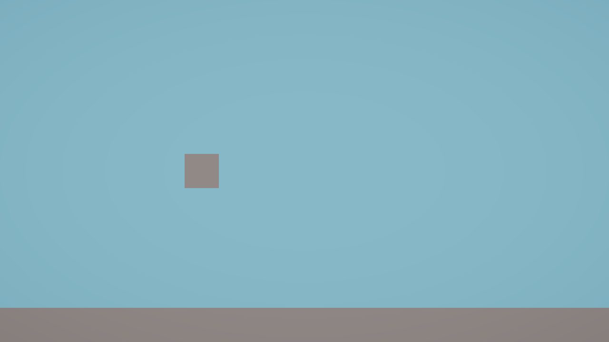
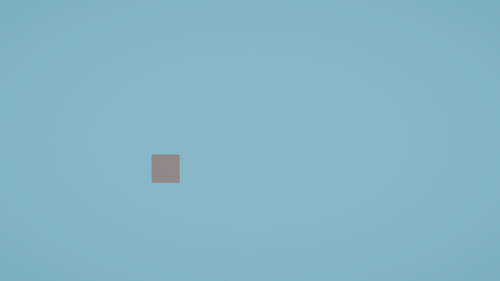

# cp-02. 화면과 좌표를 확정한다

<!--
상태:     초안
근거커밋: (이 챕터를 담은 커밋)
의존값:   Ortho Size 5 / 화면 y −5~5 / 화면 x −8.889~8.889 / 새 스케일 1 / 바닥 중심 y −4.5, 스케일 (20,1,1)
          → 이 값이 바뀌면 cp-06·09·10·15 챕터도 재검토
대체예정: 없음
-->

> **이번 목표** — 게임 화면을 만든다. 하늘색 배경에 네모난 새가 왼쪽 가운데, 바닥이 아래에 보이게 한다.



아직 아무것도 움직이지 않는다. **움직이는 건 다음부터다.** 지금은 "무대"를 만든다.

---

## 시작하기 전에

- [ ] Unity 로 프로젝트가 열려 있다
- [ ] 화면 가운데에 `SampleScene` 이라고 적힌 탭이 보인다

---

## 알아야 할 것

처음 보는 말이 많이 나온다. **여기를 건너뛰면 뒤가 전부 막힌다.** 천천히 읽자.

### 씬 (Scene)

**게임의 한 화면을 담아두는 파일**이다.

> **비유** — 연극의 무대 하나. 무대 위에 배우와 소품을 올려두고, 그 상태를 통째로 저장해두는 것이다.

우리는 `SampleScene` 이라는 씬 하나에서 게임 전체를 만든다. 씬을 저장하지 않으면 방금 한 일이 사라진다.

⚠️ **헷갈리기 쉬운 것** — 씬을 저장하는 것과 프로젝트를 저장하는 것은 다르다. 씬 탭 이름 옆에 별표(`*`)가 붙어 있으면 **아직 저장 안 된 것**이다.

### 게임오브젝트 (GameObject)

**씬 위에 놓이는 물건 하나하나**다. 새도, 바닥도, 카메라도 전부 게임오브젝트다.

> **비유** — 무대 위의 배우와 소품. 각각이 하나의 게임오브젝트다.

⚠️ **헷갈리기 쉬운 것** — 게임오브젝트 자체는 **아무 능력도 없는 빈 껍데기**다. "보이는 것", "움직이는 것" 같은 능력은 전부 아래의 컴포넌트가 준다.

### 컴포넌트 (Component)

**게임오브젝트에 붙이는 능력 하나**다.

> **비유** — 배우에게 입히는 옷과 소품. 모자를 씌우면 모자 쓴 배우가 되고, 마이크를 쥐여주면 말하는 배우가 된다.

예를 들어 네모를 하나 만들면 이런 컴포넌트가 붙어 있다.

| 컴포넌트 | 하는 일 |
|---|---|
| Transform | 어디에, 어느 방향으로, 얼마나 크게 있는지 |
| Mesh Filter | 어떤 모양인지 (네모인지 공인지) |
| Mesh Renderer | 그 모양을 화면에 그린다 |
| Box Collider | 부딪힘을 감지한다 (19번에서 쓴다) |

**게임오브젝트 = 껍데기 + 컴포넌트 여러 개.** 이 문장이 Unity 의 거의 전부다.

### Transform

**모든 게임오브젝트가 반드시 하나씩 갖고 있는 컴포넌트.** 위치·회전·크기를 담는다.

| 칸 | 뜻 |
|---|---|
| Position | 어디에 있나 |
| Rotation | 얼마나 돌아가 있나 |
| Scale | 원래 크기의 몇 배인가 |

⚠️ **헷갈리기 쉬운 것** — Transform 은 **지울 수 없다.** 위치가 없는 물건은 있을 수 없기 때문이다.

### 좌표 (x, y, z)

**위치를 숫자로 말하는 방법**이다. Unity 는 세 개를 쓴다.

| | 방향 | 값이 커지면 |
|---|---|---|
| **x** | 가로 | 오른쪽으로 |
| **y** | 세로 | 위로 |
| **z** | 깊이 | 화면 안쪽으로 |

우리 게임은 **옆에서 보는 2D 게임**이라 z 는 계속 0 이다. 신경 쓸 건 x 와 y 뿐이다.

`(-3, 0, 0)` 은 "가운데에서 왼쪽으로 3칸" 이라는 뜻이다.

⚠️ **헷갈리기 쉬운 것** — 1칸이 몇 센티미터인지는 정해져 있지 않다. **우리가 정하는 것**이다. 이 게임에서는 새 한 마리가 딱 1칸 크기다.

### Scene 뷰 와 Game 뷰

창이 두 개인데 **보여주는 게 다르다.**

| | 무엇인가 | 언제 보나 |
|---|---|---|
| **Scene 뷰** | 작업용 화면. 자유롭게 돌려보고 확대할 수 있다 | 물건을 배치할 때 |
| **Game 뷰** | **플레이어가 실제로 보게 될 화면** | 결과를 확인할 때 |

⚠️ **아주 중요** — 이 항목의 확인은 **Game 뷰 기준**이다. Scene 뷰에서 잘 보인다고 되는 게 아니다. 플레이어는 Game 뷰만 본다.

### 카메라 — Perspective 와 Orthographic

카메라는 **어느 화면을 플레이어에게 보여줄지** 정하는 게임오브젝트다.

찍는 방식이 두 가지 있다.

| | 뜻 | 특징 |
|---|---|---|
| **Perspective** (원근) | 사람 눈처럼 | 멀리 있는 게 작게 보인다 |
| **Orthographic** (평행) | 도면처럼 | **거리와 상관없이 같은 크기** |

우리는 **Orthographic** 을 쓴다. 옆에서 보는 2D 게임이라 원근이 있으면 오히려 방해된다.

### Orthographic Size

**화면에 세로로 몇 칸이 보일지** 정하는 숫자다. **위아래 절반의 칸 수**를 적는다.

`Size = 5` 로 하면 화면 세로가 이렇게 된다.

```
   y = +5   ─── 화면 위쪽 끝
              │
   y =  0   ─┼─ 카메라가 보는 한가운데
              │
   y = −5   ─── 화면 아래쪽 끝
```

**이 게임은 `Size = 5` 로 고정한다.** 뒤에서 나오는 숫자들이 전부 이 값을 기준으로 계산돼 있어서, 다른 값을 넣으면 나중에 전부 어긋난다.

⚠️ **헷갈리기 쉬운 것** — Size 는 세로만 정한다. **가로는 화면 비율에 따라 자동으로 정해진다.**

### 화면 비율 (Aspect)

**가로와 세로의 비율**이다. `16:9` 는 요즘 모니터·유튜브 화면과 같은 비율이다.

우리는 `16:9` 로 고정한다. 그러면 가로는 이렇게 계산된다.

```
가로 절반 = 세로 절반 × (16 ÷ 9) = 5 × 1.778 = 8.889
→ 화면 가로는 x = −8.889 ~ +8.889
```

이 숫자는 **직접 재서 확인한 값**이다. 외울 필요는 없고, "가로가 세로보다 훨씬 넓다" 정도만 알면 된다.

### Hierarchy 창 과 Inspector 창

| 창 | 무엇을 보여주나 | 보통 어디에 있나 |
|---|---|---|
| **Hierarchy** | 지금 씬에 있는 게임오브젝트 **목록** | 왼쪽 |
| **Inspector** | **선택한** 게임오브젝트의 컴포넌트와 값 | 오른쪽 |

**Hierarchy 에서 클릭 → Inspector 에서 값을 고친다.** 이 흐름을 앞으로 계속 반복한다.

> 창이 안 보이면: 위쪽 메뉴 `Window > General > Hierarchy` (또는 `Inspector`)

---

## 해보기

### 1. 먼저 계산해보자 — 손으로

물건을 놓기 전에 하나만 계산해보자. **이걸 스스로 해내는 게 이번 항목의 진짜 목표다.**

바닥을 이렇게 놓을 것이다.

- 바닥의 **중심** y = **−4.5**
- 바닥의 **세로 크기(Scale Y)** = **1**

**그러면 바닥의 윗면은 y 얼마일까?** 새는 이 윗면 위에 서게 된다.

```
답: y = ________
```

<details>
<summary>힌트가 필요하면 (누르기 전에 한 번 더 생각해보자)</summary>

Scale 은 **원래 크기의 몇 배**인지다. 네모의 원래 세로 크기는 1칸이다.
중심에서 윗면까지는 세로 크기의 **절반**이다.
</details>

### 2. 템플릿 정리하기

프로젝트를 새로 만들면 씬에 연습용 물건이 들어 있을 수 있다.

1. **Hierarchy** 창을 본다
2. `Main Camera`, `Directional Light`, `Global Volume` **외의 것**이 있으면 클릭하고 `Delete` 키를 누른다

> `Main Camera` / `Directional Light` / `Global Volume` 셋은 **지우면 안 된다.**

### 3. 카메라 맞추기

1. **Hierarchy** 에서 `Main Camera` 를 클릭한다
2. **Inspector** 에서 `Transform` 의 `Position` 을 이렇게 고친다

   | X | Y | Z |
   |---|---|---|
   | 0 | **0** | −10 |

   > **Y 를 꼭 0 으로 바꿔야 한다.** 처음에 `1` 로 되어 있다. 이유는 아래 「안 되면」에 있다.
   > Z 가 −10 인 것은 카메라가 **뒤에서** 무대를 바라봐야 하기 때문이다.

3. 조금 아래 `Camera` 컴포넌트에서 `Projection` 을 `Perspective` → **`Orthographic`** 으로 바꾼다
4. 바로 아래 생긴 `Size` 칸에 **`5`** 를 넣는다
5. `Environment` 항목을 펼쳐서
   - `Background Type` 을 **`Solid Color`** 로 바꾼다
   - `Background` 색깔 칸을 클릭하고, 색 고르는 창의 `Hexadecimal` 칸에 **`87CEEB`** 를 입력한다 (하늘색)

### 4. 새 만들기

1. **Hierarchy** 의 **빈 곳에서 마우스 오른쪽 클릭** → `3D Object` → `Cube`
2. 생긴 `Cube` 를 한 번 더 클릭하고 `F2` 키를 눌러 이름을 **`Bird`** 로 바꾼다
3. **Inspector** 에서 `Transform` 을 이렇게 맞춘다

   | | X | Y | Z |
   |---|---|---|---|
   | Position | **−3** | **0** | **0** |
   | Rotation | 0 | 0 | 0 |
   | Scale | **1** | **1** | **1** |

> 네모가 새라니 이상하지만 지금은 이걸로 간다. **모양은 25번에서 바꾼다.** 지금 예쁘게 만들려고 시간을 쓰면 정작 게임이 안 굴러간다.

### 5. 바닥 만들기

1. 같은 방법으로 `Cube` 를 하나 더 만든다
2. 이름을 **`Ground`** 로 바꾼다
3. `Transform` 을 이렇게 맞춘다

   | | X | Y | Z |
   |---|---|---|---|
   | Position | 0 | **−4.5** | 0 |
   | Rotation | 0 | 0 | 0 |
   | Scale | **20** | **1** | 1 |

> Scale X 가 20 인 이유 — 화면 가로가 약 17.8칸이라, 20칸이면 화면을 다 덮고도 남는다.

### 6. Game 뷰 비율 맞추기

1. 가운데 위쪽의 **`Game`** 탭을 클릭한다
2. 탭 바로 아래 왼쪽에 있는 드롭다운(처음엔 `Free Aspect`)을 클릭한다
3. **`16:9`** 를 고른다

### 7. 저장

`Ctrl + S` **(Mac 은 `Cmd + S`)**

씬 탭 이름 옆의 별표(`*`)가 사라지면 저장된 것이다.

---

## 확인하기

**Game 뷰**를 보면서 확인하자. Scene 뷰가 아니다.

- [ ] 배경이 하늘색이다
- [ ] 회색 네모(새)가 **화면 왼쪽, 위아래로는 가운데**에 보인다
- [ ] 바닥이 **화면 아래쪽에 가로로 길게** 보인다
- [ ] Game 뷰 왼쪽 위 드롭다운이 `16:9` 다
- [ ] 씬 탭에 별표(`*`)가 없다

### 말로 설명해보기

> **바닥 윗면이 y = −4 인 이유를 Inspector 값을 짚으면서 말해보자.**

"중심이 −4.5 이고, 세로 크기가 1이니까 중심에서 위로 0.5칸. 그래서 −4.5 + 0.5 = −4."

이걸 자기 말로 할 수 있으면 통과다. **이 계산 방식은 09번에서 새가 바닥에 닿는 판정을 만들 때 똑같이 쓴다.**

---

## 안 되면

### 바닥이 아예 안 보인다

**가장 많이 겪는 문제다.** 실제로 이렇게 보인다.



**원인** — 카메라의 `Position Y` 가 `1` 로 남아 있다. Unity 가 프로젝트를 만들 때 넣어주는 기본값이다.

카메라 Y 가 1 이면 화면이 **위로 1칸 밀린다.**

```
카메라 Y = 1  →  화면 세로 = −4 ~ 6      바닥 윗면(−4)이 화면 맨 아래 끝과 겹침 → 안 보임
카메라 Y = 0  →  화면 세로 = −5 ~ 5      바닥이 화면 안에 들어옴 → 보임
```

바닥 윗면이 −4 이고 화면 아래 끝도 정확히 −4 라서, **바닥이 한 픽셀도 안 보인다.** 지운 것도 아닌데 사라진 것처럼 보여서 오래 헤매게 된다.

**고치는 법** — `Main Camera` 의 `Position Y` 를 `0` 으로.

### 새가 너무 크거나 작다

**원인** — `Size` 를 5 가 아닌 값으로 넣었다.

Size 는 "화면에 세로로 몇 칸이 보이나" 이므로, 값이 작을수록 **적게 보이고 = 확대된다.** 물건이 커진 게 아니라 카메라가 당겨진 것이다.

**고치는 법** — `Main Camera` 의 `Size` 를 `5` 로.

### 새와 바닥이 똑같은 회색이라 구분이 안 된다

**정상이다.** 색은 **다음 항목(03)에서** 입힌다.

### Game 뷰가 안 보인다

**고치는 법** — 위쪽 메뉴 `Window > General > Game`

### 값을 넣었는데 Game 뷰가 그대로다

**원인** — Inspector 칸에 숫자를 치고 나서 `Enter` 를 안 눌렀다. 다른 곳을 클릭해도 반영된다.

---

## 그래도 안 되면 — 답

> 위 「계산해보자」를 스스로 해봤다면 봐도 된다.

**바닥 윗면 y 값**

```
−4.5 + (1 ÷ 2) = −4
```

중심이 −4.5, 세로 크기가 1칸이니 중심에서 윗면까지는 0.5칸. 그래서 윗면은 −4.

**최종 값 정리**

| 오브젝트 | Position (X, Y, Z) | Scale (X, Y, Z) | 그 밖에 |
|---|---|---|---|
| Main Camera | (0, 0, −10) | (1, 1, 1) | Orthographic, Size 5, Solid Color `87CEEB` |
| Bird | (−3, 0, 0) | (1, 1, 1) | |
| Ground | (0, −4.5, 0) | (20, 1, 1) | |

---

## 더 알고 싶으면

**화면 가로는 왜 −8.889 ~ 8.889 인가**

Size 5 는 세로 절반이 5칸이라는 뜻이다. 16:9 화면이니 가로 절반은

```
5 × (16 ÷ 9) = 5 × 1.7778 = 8.889
```

앞으로 파이프를 화면 밖 `x = 11` 에서 내보낼 텐데, 8.889 보다 크니까 **화면 밖에서 나타나는 것처럼 보인다.** 11번에서 다시 만난다.

**z 는 왜 계속 0 인가**

옆에서 보는 게임이라 깊이가 필요 없다. 다만 **3D 프로젝트**라 z 가 존재하긴 한다. 10번에서 물리를 켜면 새가 z 방향으로 밀려나는 일이 생길 수 있어서, 그때 z 를 0 에 고정하는 방법을 배운다.

---
---

<!--
═══════════════════════════════════════════════
 교수님께 — 학생용 교재에는 안 들어가는 부분
═══════════════════════════════════════════════

## 먼저 겪게 할 것
- **바닥 윗면 y 계산을 반드시 학생이 먼저 하게 한다.** 이 계산 방식이 cp-09 의 바닥 판정으로
  그대로 이어진다. 여기서 대신 계산해주면 09 에서 "왜 -3.5 인가"를 또 못 푼다
- 카메라 Y=1 은 미리 말하지 않는다. 바닥이 안 보이는 상태를 직접 만나고,
  "화면 아래끝이 몇이지?" 로 유도한다. 좌표로 화면을 추론하는 첫 경험이 된다

## 시연 절차
1. Game 뷰와 Scene 뷰를 나란히 놓고 "플레이어가 보는 건 어느 쪽?" 부터 묻는다
2. Projection 을 Perspective ↔ Orthographic 토글하며 차이를 눈으로 보여준다
3. Size 를 3 / 5 / 8 로 바꿔가며 "숫자가 커지면 왜 작아 보이나" 를 묻는다

## 분량
- 내가 걸린 시간: 배치·검증 포함 약 25분 (실측·스크린샷 제외하면 10분)
- 학생 예상: 40~55분. 창 이름과 용어가 처음이라 여기서 가장 많이 걸린다
- 수업 배분 의견: **용어 설명에 절반을 쓴다.** 이 항목에만 새 용어가 11개다.
  배치 자체는 5분이면 끝나므로, 조작을 서두르고 용어를 건너뛰면 04번부터 무너진다

## 검증 기록
| 체크 문장의 조건 | 결과 | 근거 |
|---|---|---|
| Game 뷰에서 새가 화면 왼쪽 가운데 | O | 새 (-3, 0, 0), 화면 x −8.889~8.889 → 좌측 1/3 지점. 스크린샷 done.png |
| 바닥이 아래에 보인다 | O | 바닥 y −5.0~−4.0, 화면 아래끝 −5.0 → 화면 안. 스크린샷 확인 |
| 배경이 하늘색 | O | clearFlags=SolidColor, backgroundColor=#87CEEB |
| Aspect 16:9 | O | cam.aspect=1.7778, pixel 1920x1080 |
| 카메라 (0,0,−10), Ortho Size 5 | O | 실측 화면 세로 −5~5, 가로 −8.889~8.889 (Viewport 변환으로 교차검증 일치) |
| 바닥 윗면 y=−4 | O | Renderer.bounds.max.y = −4.000 |

검증 방법: script-execute(Roslyn) 로 카메라/Renderer bounds 실측 + Viewport→World 교차검증,
Camera.Render() → RenderTexture → PNG 로 Game 뷰 캡처

실측값 (뒤 항목이 참조):
- 화면 세로 y = −5.000 ~ 5.000
- 화면 가로 x = −8.889 ~ 8.889
- 바닥 윗면 y = −4.000
- 새가 바닥에 얹힐 때 중심 y = −3.50   ← cp-09 의 "바닥 −3.5" 와 일치
- 새가 천장에 닿을 때 중심 y = 4.50    ← cp-09 의 "천장 4.5" 와 일치

## 이슈 처리
- 이슈 #4(Ortho Size 미지정) 해소. Size 3/4/6 을 모두 재봤고 5 만 cp-09 와 맞는다.
  syllabus cp-02 체크에 Size=5 를 명시했다

## 커밋
`2부 cp-02 - 화면과 좌표를 확정한다` / 태그 `cp-02`
-->
