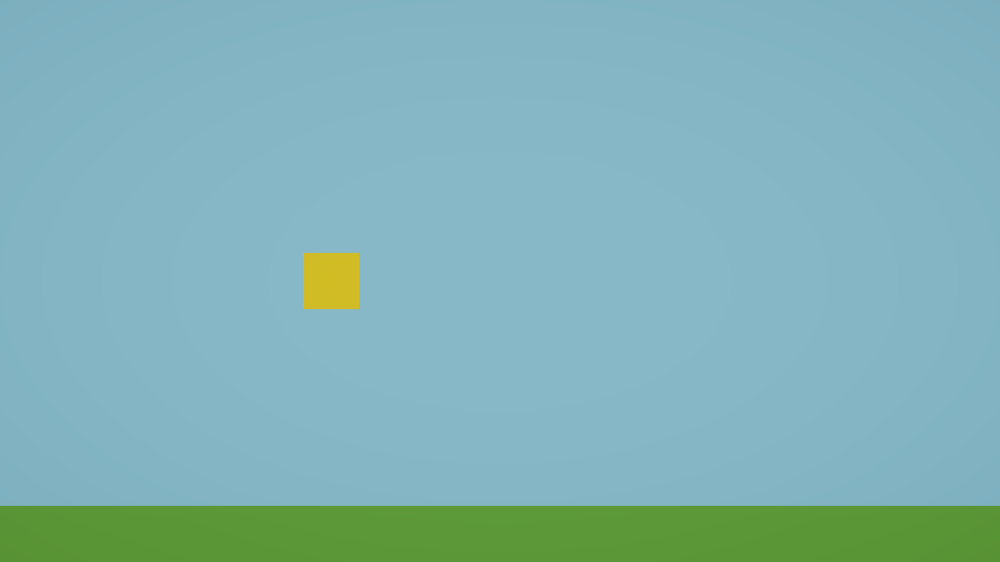

# cp-03. 색을 입힌다  〔아트·기획〕

<!--
상태:     초안
근거커밋: (이 챕터를 담은 커밋)
의존값:   배경 하늘색 #87CEEB (cp-02) / 새 #FFC800 / 바닥 #4C9A2A
          셰이더 "Universal Render Pipeline/Lit"
대체예정: cp-25 에서 겉모습을 바꿀 때 이 머티리얼을 교체한다 (구조는 그대로)
-->

> **이번 목표** — 새와 바닥에 서로 다른 색을 입혀서, 화면에서 한눈에 구분되게 한다.



여전히 아무것도 안 움직인다. 그런데 **이제 게임처럼 보이기 시작한다.**

---

## 시작하기 전에

- [ ] Game 뷰에 하늘색 배경, 회색 네모(새), 회색 바닥이 보인다
- [ ] 새와 바닥이 **똑같은 회색**이라 구분이 잘 안 된다

바로 그 문제를 지금 해결한다.

---

## 알아야 할 것

### 머티리얼 (Material)

**물건의 겉모습을 담아두는 파일**이다. 색, 반짝임, 무늬 같은 것이 들어 있다.

> **비유** — 페인트 한 통. 통 하나를 만들어두고 여러 물건에 칠할 수 있다.

⚠️ **아주 중요** — 머티리얼은 **물건에 들어 있는 게 아니라 따로 있는 파일**이다.
페인트 통 하나로 벽 세 개를 칠했다면, **통의 색을 바꾸는 순간 벽 세 개가 전부 바뀐다.**

그래서 새와 바닥은 **머티리얼을 각각 따로** 만들어야 한다. 하나를 같이 쓰면 색을 나눌 수 없다.

### 셰이더 (Shader)

**"이 물건을 화면에 어떤 방식으로 그릴지" 정해둔 계산 규칙**이다.

> **비유** — 페인트의 종류. 유광이냐 무광이냐, 빛을 받으면 어떻게 보이냐를 정한다.

우리는 `Universal Render Pipeline/Lit` 을 쓴다. `Lit` 은 "빛을 받는다" 는 뜻이다. 이 프로젝트에서 새 머티리얼을 만들면 **자동으로 이게 선택되므로 건드릴 일이 없다.**

지금은 **"머티리얼 안에는 셰이더가 하나 들어 있다"** 정도만 알면 충분하다.

### Project 창

**프로젝트에 들어 있는 모든 파일의 목록**이다. 보통 아래쪽에 있다.

| | 무엇을 보여주나 |
|---|---|
| **Hierarchy** | 지금 **씬 안에** 놓인 게임오브젝트 |
| **Project** | 디스크에 **저장된 파일** (머티리얼, 스크립트, 씬…) |

⚠️ **헷갈리기 쉬운 것** — 둘 다 목록이라 헷갈린다. **Hierarchy = 무대 위 / Project = 창고**로 기억하자.

> 안 보이면: `Window > General > Project`

### 드래그 앤 드롭으로 적용하기

Unity 에서는 **파일을 끌어다 놓는 것**이 곧 "적용" 이다.

Project 창의 머티리얼을 마우스로 집어서 **Hierarchy 의 오브젝트 이름 위**나 **Scene 뷰의 물건 위**에 떨어뜨리면 색이 입혀진다.

---

## 해보기

### 1. 먼저 정해보자 — 무슨 색으로 할까

이 항목은 **아트·기획** 항목이다. 색은 정답이 없다. 다만 조건이 하나 있다.

> **배경(하늘색), 새, 바닥 — 이 셋이 서로 구분돼야 한다.**

색을 고르기 전에 한 가지만 생각해보자.

**새는 게임 내내 어디를 배경으로 날아다닐까?**

```
답: ________________
```

이게 왜 중요한지는 「더 알고 싶으면」에서 다룬다. 지금은 일단 골라보자.

이 교재는 아래 두 색으로 진행한다. **다른 색을 쓰고 싶으면 그렇게 해도 된다.**

| | 색 | Hex 코드 |
|---|---|---|
| 새 | 노랑 | `FFC800` |
| 바닥 | 풀색 | `4C9A2A` |

### 2. 머티리얼 만들기

1. **Project** 창에서 `Assets` > `Materials` 폴더를 클릭한다
2. 폴더 안 **빈 곳에서 마우스 오른쪽 클릭** → `Create` > `Rendering` > `Material`
3. 이름을 **`BirdMaterial`** 로 입력하고 `Enter`
4. 같은 방법으로 하나 더 만들어 **`GroundMaterial`** 로 이름 짓는다

> Unity 버전에 따라 `Create > Material` 로 바로 있는 경우도 있다. 둘 다 같은 것이다.

### 3. 색 넣기

1. Project 창에서 **`BirdMaterial`** 을 클릭한다
2. **Inspector** 에서 `Base Map` 이라고 적힌 줄을 찾는다
3. 그 오른쪽의 **색깔 네모**를 클릭한다
4. 색 고르는 창이 뜨면 아래쪽 `Hexadecimal` 칸에 **`FFC800`** 을 입력하고 `Enter`
5. 창을 닫는다

**`GroundMaterial`** 도 똑같이 하되 **`4C9A2A`** 를 넣는다.

> `Base Map` 이 안 보이면 Inspector 위쪽 `Surface Inputs` 를 펼쳐보자.

### 4. 오브젝트에 입히기

1. Project 창의 **`BirdMaterial`** 을 마우스로 **집어서**
2. **Hierarchy** 의 **`Bird`** 위에 **떨어뜨린다**
3. 같은 방법으로 **`GroundMaterial`** 을 **`Ground`** 위에 떨어뜨린다

### 5. 저장

`Ctrl + S`

---

## 확인하기

**Game 뷰**에서 확인하자.

- [ ] 새가 노란색이다
- [ ] 바닥이 초록색이다
- [ ] 새와 바닥이 **서로 다른 색**이다
- [ ] 화면을 흘끗 봤을 때 셋(하늘·새·바닥)이 **한눈에 구분된다**
- [ ] 씬 탭에 별표(`*`)가 없다

---

## 안 되면

### 색을 바꿨는데 화면이 그대로다

**원인 1** — 머티리얼을 만들기만 하고 **오브젝트에 안 떨어뜨렸다.**
머티리얼은 만든다고 저절로 적용되지 않는다. 반드시 끌어다 놓아야 한다.

**확인하는 법** — `Bird` 를 클릭하고 Inspector 의 `Mesh Renderer` 안 `Materials` 칸을 본다. `BirdMaterial` 이 들어 있어야 한다. `Lit` 이나 `Default-Material` 이면 아직 적용 안 된 것이다.

**원인 2** — `Base Map` 이 아니라 다른 칸의 색을 바꿨다. `Emission` 같은 다른 칸을 건드리면 이상하게 보인다.

### 새와 바닥이 **둘 다** 같이 바뀐다

**원인** — 머티리얼 **하나**를 두 오브젝트에 다 적용했다.

머티리얼은 페인트 통이다. 같은 통으로 칠하면 같은 색이 될 수밖에 없다. **`BirdMaterial` 과 `GroundMaterial` 두 개를 따로** 만들어야 한다.

**확인하는 법** — Project 창 `Assets/Materials` 안에 머티리얼이 **두 개** 있는지 본다.

### 색이 칙칙하고 어둡게 보인다

**원인** — 씬의 `Directional Light`(빛)가 물건을 비스듬히 비추고 있어서다. 정상이다.

`Universal Render Pipeline/Lit` 셰이더는 **빛을 받아서** 색이 정해진다. 그래서 Inspector 에서 고른 색보다 조금 어둡게 보인다.

### Materials 폴더가 없다

`Assets` 위에서 오른쪽 클릭 → `Create` > `Folder` → 이름을 `Materials` 로.

---

## 그래도 안 되면 — 답

> 색을 직접 골라봤다면 봐도 된다.

**「먼저 정해보자」의 답** — 새는 게임 내내 **하늘**을 배경으로 날아다닌다. 바닥에 닿는 건 죽을 때 한 번뿐이다.

그러니 **새 색을 고를 때 가장 중요한 기준은 "바닥과 다른가" 가 아니라 "하늘과 다른가" 다.**

**이 교재가 쓴 값**

| | Hex | 어디에 |
|---|---|---|
| 배경 | `87CEEB` | Main Camera > Environment > Background |
| 새 | `FFC800` | `Assets/Materials/BirdMaterial` > Base Map |
| 바닥 | `4C9A2A` | `Assets/Materials/GroundMaterial` > Base Map |

---

## 더 알고 싶으면

### 색이 다른 것과 "구분되는 것" 은 다르다

색을 비교하는 방법은 크게 두 가지다.

| | 뜻 | 예 |
|---|---|---|
| **색상(hue)** 차이 | 무슨 색인가 | 노랑 ↔ 파랑 |
| **밝기(명암)** 차이 | 얼마나 밝은가 | 노랑 ↔ 검정 |

**둘 중 하나만 달라도 눈으로는 구분된다.** 하지만 **흑백으로 인쇄하거나, 색을 잘 구분 못 하는 사람이 보면 밝기 차이만 남는다.**

이 교재가 고른 색들의 밝기 차이를 실제로 재보면 이렇다. (숫자가 클수록 잘 구분된다)

| | 밝기 차이 |
|---|---|
| 새 ↔ 바닥 | 2.27 |
| 바닥 ↔ 하늘 | 2.02 |
| **새 ↔ 하늘** | **1.12** ← 거의 같다 |

**새와 하늘은 색상이 완전히 달라서(노랑↔파랑) 눈으로는 잘 보이지만, 밝기는 거의 같다.**
흑백으로 바꾸면 새가 하늘에 묻혀버린다는 뜻이다.

### 그래서 어떻게 해야 하나

밝기 차이를 **3.0 이상**으로 만들면 흑백으로 봐도 확실히 구분된다. 여러 색을 재봤더니 이랬다.

| 새 색 후보 | vs 하늘 | vs 바닥 |
|---|---|---|
| 노랑 `FFC800` | 1.12 | 2.27 |
| 주황 `FF7A00` | 1.50 | 1.35 |
| 빨강 `E03131` | 2.59 | 1.28 |
| 흰색 `FFFFFF` | 1.74 | 3.52 |
| **검정 `2B2B2B`** | **8.13** | **4.02** |
| **남색 `1E1E5A`** | **8.68** | **4.29** |

**어두운 색만 둘 다 통과한다.** 하늘이 밝고 바닥이 중간 밝기라서, 둘 다와 대비되려면 어두워야 하기 때문이다.

이 교재는 **노랑을 유지했다.** 색으로 보면 충분히 구분되고, 플래피 버드 하면 떠오르는 색이기 때문이다. 하지만 이건 **선택**이지 정답이 아니다.

> **해보면 좋은 것** — 새를 남색 `1E1E5A` 으로 바꿔서 Game 뷰를 비교해보자.
> 어느 쪽이 더 잘 보이나? 어느 쪽이 더 마음에 드나? **이 둘이 다를 수 있다는 게 기획의 어려운 점이다.**

### 25번 예고

지금은 네모에 색만 입혔다. **25번에서 진짜 모양으로 바꾼다.** 그때도 머티리얼을 갈아끼우는 방식은 똑같다.

---
---

<!--
═══════════════════════════════════════════════
 교수님께
═══════════════════════════════════════════════

## 먼저 겪게 할 것
- **머티리얼 하나를 두 오브젝트에 적용해보게 한다.** 색이 같이 바뀌는 걸 직접 본 학생만
  "머티리얼은 오브젝트 안에 있는 게 아니라 따로 있는 파일" 을 이해한다.
  이건 11번의 프리팹(하나 고치면 전부 바뀐다)으로 그대로 이어지는 감각이다
- 색 고르기는 학생에게 맡긴다. 교재 값을 강제하지 않는다. 단 **"셋이 구분되는가"** 만 확인한다

## 시연 절차
1. Project 창과 Hierarchy 창을 나란히 놓고 "무대 위 / 창고" 차이부터 짚는다
2. 머티리얼 하나를 만들어 새와 바닥에 **둘 다** 적용해 보이고, 색을 바꿔서 같이 변하는 걸 보여준다
3. 그 다음에 두 개로 나눈다

## 분량
- 내가 걸린 시간: 배치 5분 + 색 검증(명암비 측정·후보 비교) 20분
- 학생 예상: 20~30분. 조작 자체는 쉽지만 Project 창을 처음 쓴다
- 수업 배분 의견: **짧게 끝내고 04로 넘어간다.** 색 고르기에 시간을 많이 쓰는 학생이
  나오는데, 아트 항목이라 막지는 말되 "나중에 25번에서 제대로 바꾼다" 로 안내한다

## 검증 기록
| 체크 문장의 조건 | 결과 | 근거 |
|---|---|---|
| 새와 바닥이 서로 다른 색 | O | BirdMaterial #FFC800 / GroundMaterial #4C9A2A, 별도 에셋 2개 |
| Game 뷰에서 한눈에 구분된다 | O | 스크린샷 done.png. 명암비 새↔바닥 2.27, 바닥↔하늘 2.02 |

검증 방법: Roslyn 으로 머티리얼 생성·적용 후 WCAG 상대휘도 기반 명암비 계산,
Camera.Render() 로 Game 뷰 캡처해 육안 확인

실측값:
- 명암비 새↔바닥 2.27 / 바닥↔하늘 2.02 / 새↔하늘 1.12
- 후보 8색 측정 결과 하늘·바닥 양쪽에 3.0 이상인 것은 검정(4.02)·남색(4.29) 뿐

## 알아둘 것 — 이 항목은 설명 게이트가 아니다
CLAUDE_Test_.md 가 cp-03 을 게이트로 지목하고 있었으나, syllabus 의 cp-03 체크는
"한눈에 구분된다" 로 끝나고 설명을 요구하지 않는다. 확인 결과 튜터 규칙 쪽 목록이
틀린 것이었고 고쳤다 (docs/이슈.md #7). 이 항목에서 억지 설명 질문을 만들지 않아도 된다.

## 커밋
`2부 cp-03 - 색을 입힌다` / 태그 `cp-03`
-->
